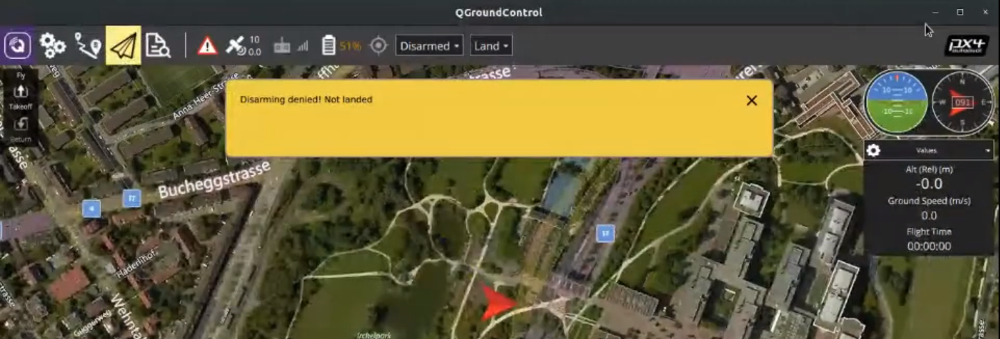
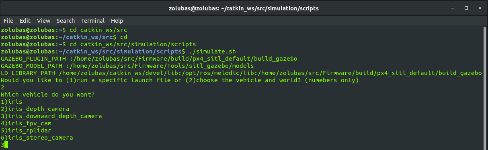
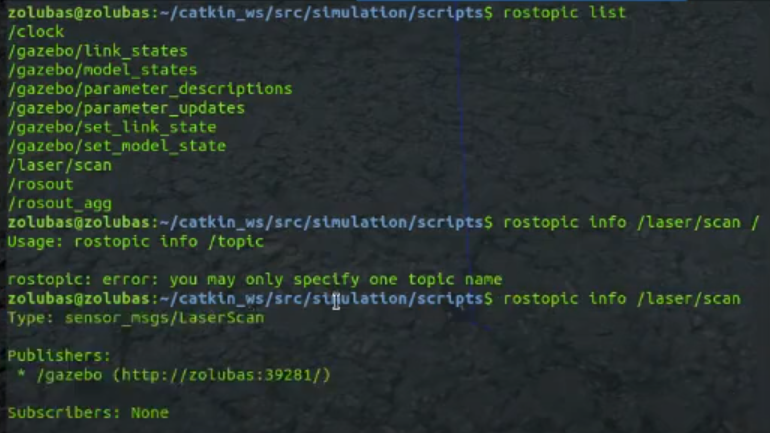

# Exercício Prático: Coletando Dados de um Drone com ROS  + PYTHON + GAZEBO 

Por Fernando Zolubas Preto e Henrique Barros.

No workshop acima você viu um pouco da teoria por trás do ROS e uma série de templates para ajudar no uso da ferramenta. A seguir será mostrado um passo-a-passo de um exemplo de aplicação de parte desses conceitos num drone simulado no Gazebo usando o ROS Melodic no Ubuntu 18.04 LTS.

O intuito aqui é dar o ponta pé inicial pra você seguir no seu aprendizado já decolando no mundo dos drones! **Let's fly?**

## Pré-requisitos
* Instalação Completa do [Getting Started](https://dev.px4.io/master/en/setup/getting_started.html) do  PX4 developer guide.
* Instalação do pacote [Simulation](https://github.com/SkyRats/simulation) da Equipe Skyrats
* Instalação do python
* Instalação QgroundControl
* Ter lido o Workshop acima 

## Pacote Simulation da SKYRATS

Você deve instalar esse pacote no diretório a seguir. Caso tenha salvo em outro diretório por favor mova a pasta **simulation** para o diretório correto.

`~/catkin_ws/src`

A instalação na verdade é realizada pelo seguinte comando:
```
cd catkin_ws/src
git clone https://github.com/SkyRats/simulation.git
```

## Compilando o Firmware
Nós queremos nesse tutorial usar o drone Iris com optical flow. Para usar o drone Iris com outros sensores ou outros veículos vide [PX4 Developer Guide/GazeboSimulation](https://dev.px4.io/v1.9.0/en/simulation/gazebo.html).

Para fazer isso, no terminal faça o seguinte comando:

```
cd src/Firmware
make px4_sitl gazebo_iris_opt_flow
```
**OBS:** 
Se demorar mais de 5 min e travar o mouse e o PC compleatmente desligue o computador no botão de shutdown. Religue o PC e tente novamente. (Isso é comum).

Para eveitar isso você deve rodar esse comando com todos os outros apps do PC desligados incluindo o navegador pois esse comando consome muita memória RAM.

Quando der certo também vai travar mas com alguma paciência você vai conseguir mexer um pouco o mouse.

## Decolando o Drone no Gazebo
Depois de compilar o Firmware você deve ver um terminal pareceido com o mostrado na imagem e o dorne no gazebo que é o porgrama ao fundo do termianl.


Experimente alguns comandos e decole uma trajetória de sucesso no maravilhoso mundo das simulações.

No próprio terminal use os seguintes comandos:

Armar o Drone
```
commander arm
```

Decolar o Drone
```
commander takeoff
```
Decolar o Drone
```
commander land
```
## QgroundControl
Ela funciona como uma interface gráfica para alterar os parâmetros do Firmware e calibração dos sensores. Permite o planjeamento de rotas de vôo de maneira lowcode.


*Vocabulário: "**Firmware** é uma classe específica de software de computador que fornece controle de baixo nível para o hardware específico do dispositivo". - Wikipedia*

Ligue a QgroundControl com o os comandos anteriores ainda ativos, isto é, com o gazebo e tudo mais ainda ativos. 

Verifique se o software reconhece o drone no gazebo. A tela deve ser parecida com a da imagem acima. É possível que no seu caso a interface gráfica não abra. Se for o seu caso procure solucionar o problema procurando em forums na internet.

Mais experiências com essa ferramente em breve 🏗

# Simulando

## Usando o Pacote Simulation
Depois de rodar o comando `make` que deve ter feito um carinho no sua memória RAM você já pode iniciar uma simulação dessa versão do Firmware com um comando bastante simples valendo-se do pacote simulation.

OBS: Feche tudo que abriu para o exercício anterior.

Abra um terminal
O comando a seguir encaminha você pro diretório onde se encontra o executável simulate.sh

O comando `./` serve para executar arquivos .sh
```
cd catkin_ws/src/simulation/scripts
./simulate.sh
```


Irá aparecer esse conjunto de opções. Para esse tutorial iremos escolher
* opção `2` para escolhermos nosso mundo e drone * 
* opção `5` para escolhermos o drone Iris com rplidar
* opção `3` para escolhermos o mundo "empty"

Isso vai abrir o gazebo com o drone (note que acima dele tem uma caixa que é o rplidar) e o terminal vai ficar com a mesma cara da outra vez que você usou o gazebo.

## Inspecionando os tópicos e mensagens do ROS

É aqui que a novidade começa. A partir daqui vamos examinar a estrutura do ROS em funcionamento nos itens a seguir pegar dados do ROS e manipula-los em python para fazer o que quisermos.


Queremos ver quais tópicos estão disponíveis no ROS para podermos capturar as mensagens dentro destes tópicos e usa-las para monitoramento ou controle do drone.

Vejamos os tópicos disponíveis com o comando:
```
rostopic list
```
Vejamos os tópicos disponíveis com o comando:
```
rostopic list
```


Vemos que existem uma série de tópicos disponíveis. Digamos que nós precisemos obter dados do rplidar que solicitamos na inicialização da simulação. 

Os dados sobre o rplidar que desejamos obter está no tópico `/laser/scan` 

Vejamos as mensagens de dados disponíveis dentro do tópico:
```
rostopic info /laser/scan
```
Vemos na imagem acima que o tópico é alimentado pelo publisher
*/gazebo (http://zolubas:39281)
E que **não há um subscriber**.

Vamos, pois, implementar um subscriber em python que nos permita ler os valores de posição angular

para isso é importante observar que o tipo da mensagem é
`sensor_msg/LaserScan`

Sabendo disso passamos então para o Python!

# Tratando dados do sensor em Python

Essa ultima parte do exercício será dividida em duas. Na primeira será explicado detalhadamente o que o código a seguir faz e na segunda será apresentada uma versão do script

## Explicações e Detalhes
Importando as funcionalidades do ROS para o pyton
```
import rospy 
```
Importando a sub classe `LaserScan` da classe `sensor_msgs.msg`. Explicando melhor isso basicamente existe a definição genérica do que é uma mensagem vinda de um sensor e  existe a mensagem de um sensor particular chamado LaserSacan. 

É como na lingua portuguesa mesmo. Você entende o conceito genérico de mensagem e depois entende que um email, uma carta ou um zapzap são tipos de mensagens.
```
from sensor_msgs.msg import LaserScan
```
Importando a biblioteca que permite usar `time.sleep(num)`
```
import time
```
Declarando que isso eh um node ROS. Ou seja, um dos programas que o ROS vai usar na hora de operar sua estrutura em grafos. Por isso chama node (nó).
```
rospy.init_node("meuNode")
```
**Definindo a classe cujo objeto é a mensagem do sensor.** Recebemos a tal mensagem do sensor através do ROS mas precisamos formatá-la dentro da lógica de POO do pyhton pra poder tratá-la como objeto. *Vocabulário: POO = Programação Orientada a Objetos*

**Observações:** 

O método `__init__(self)` é o construtor da classe e a linha que diz `rospy.Subscriber("/laser/scan",LaserScan,self.laser_callback)` declara esse objeto chamado dados_laserScan (representado pela palavra "self" que se refere a sua instanciação) como Subscriber do tópico `/laser/scan` para receber mensagens do tipo `LaserScan`.

o método `laser_callback` é quem lida com o conteúdo da mensagem salvando os dados do tipo `LaserScan` no atributo `laserScan_tudo` da classe `dados_laserScan.`

```
class dados_laserScan:
    def __init__(self):
        rospy.Subscriber("/laser/scan",LaserScan,self laser_callback)
    def laser_callback(self,data_do_tipo_LaserScan):
        self.laserScan_tudo = data_do_tipo_LaserScan
```
Instanciando a classe `dados_laserScan` no objeto chamado `laser_msg`
```
laser_msg = dados_laserScan()
```
Pedindo para o pc esperar 2 segundos pra dar tempo de haver alguma medida do sensor a laser
```
time.sleep(2)
```
Printando na tela o **angulo máximo** do rplidar.
```
print(laser_msg.laserScan_tudo.angle_max)
```

## Script

Como é em python se você salvar esse código em qualquer lugar vai funcionar mas é recomendavel você salvar esse script como um package do ROS. Informações de como fazer isso estão no tutorial acima. 

```
import rospy 
from sensor_msgs.msg import LaserScan
import time

#Declarando que isso eh um node
rospy.init_node("meuNode")

class dados_laserScan:
    def __init__(self):
        #Vamos declarar que esse node eh um subscriber do topico que contem a msg q queremos
        rospy.Subscriber("/laser/scan",LaserScan,self.laser_callback)
    def laser_callback(self,data_do_tipo_LaserScan):
        self.laserScan_tudo = data_do_tipo_LaserScan

laser_msg = dados_laserScan()

time.sleep(2)
print(laser_msg.laserScan_tudo.angle_max)
```
# Considerações Importantes
Esse exercício é uma versão preliminar de um exercício de inicialização com o ROS. Aqui você viu na prática como aplicar um pouco da teoria da ferramenta, isto é, conseguir capturar uma mensagem de um sensor por meio das funcionalidades do ROS através do Python. 

Porém não são discutidas aqui as melhores práticas de prorgamação para a aplicação do ROS. Por exemplo, usar um time.sleep() não é nada otimziado e provavelmente seria do interesse que o "pirnt()" estivesse dentro de um loop infinito para continuar a coleta de dados e com o devido tratamento pra que não se tentasse printar a variavel vazia ou repetidamente. Aliás prints normalmente são feitos dentro da própria classe através de algum método dela e não externamente como realizado aqui.

### Espero que tenha aproveitado o exercício e que ele tenha te ajudado em alguma coisa! Bons estudos =))


