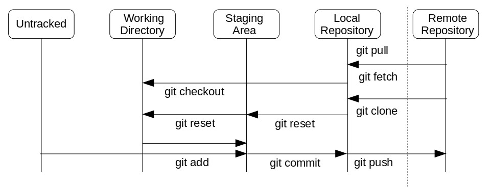

# Git: um Sistema de Controle de Versão Distribuido

## Por que controle de versão existe?

A programação antes da internet era muito diferente do que é hoje, porque era mais difícil acessar informação e compartilhar código, o que desacelerava a inovação. Mas um mundo conectado exigia novas formas de colaboração, e com elas novas ferramentas para colaborar.

Imagine que você é um programador da décade de 70 tentando, por exemplo, fazer um drone voar sozinho. Você teria que programar tudo absolutamente do zero - desde como os motores são controlados até rotinas de pouso e movimentação por exemplo, e tudo isso antes de pensar em fazer o seu drone se controlar autonomamente! Isso acontece porque você não tem acesso ao trabalho de outros programadores, já que a única forma de compartilhar código era copiando em um disquete e mandar para outras pessoas. E esse problema não existia só em robótica - desenvolver uma nova aplicação muitas vezes envolvia escrever também o sistema operacional para o computador.

O desenvolvimento da internet permitiu que arquivos fossem compartilhador mais facilmente, permitindo que várias pessaos trabalhassem remotamente em um mesmo projeto, até de diferntes países. Assim, não era preciso inventar a roda de novo toda vez, mas existia um outro problema: como lidar com equipes de programadores em lugares diferentes, modificando todos ao mesmo tempo os mesmos arquivos?

Daí vem a necessidade de sistemas de controle de versão (SCV) para vários usuários. Esses sistemas permitem que várias pessoas façam modificações, e depois encontra um jeito de juntar todas elas automaticamente. Eles também permitem muito mais, como voltar em versões passadas dos seus arquivos, de uma forma simples e integrada.

Ok, mas esse é o workshop de Git, que é só um SCV. Por que afinal a gente usa o Git? O que ele tem de especial?

## Por que o Git?

Primeiro, temos que mencionar que muitos desenvolvedores usam Git simplesmente porque é o SCV mais popular atualmente, então quase todo programador vai saber usar. Isso é importante porque queremos que o maior número de pessoas consiga usar o nosso código (foi pra isso que surgiu o controle de versão afinal).

Contudo, o Git é de fato superior e inovador em alguns aspectos:
1. É um SCV distribuido  
Isso significa que cada programador tem uma cópia de todo o código no seu computador. Assim, você consegue trabalhar mesmo sem acesso à internet, e sincronizar suas mudanças depois;
2. Guarda *snapshots* dos arquivos, não só modificações   
Assim, você consegue retornar a uma versão antiga do seu projeto muito mais facilmente;
3. Tem *branches* muito desenvolvidas  
Vamos falar de *branches* mais pra frente.

## Mas como isso funciona?

Agora que já sabemos porque o Git existe e porque usamos ele, vamos falar sobre o seu funcionamento. Antes de partirmos para os comandos, precisamos falar sobre um pouco de teoria. 

O Git funciona a partir de **repositórios**. Você pode pensar em cada repositório como um diretório em que você pode chamar os comandos do sistema de controle de versão. Vale dizer que você pode ter sub diretórios, como em qualquer pasta.

Dentro de um repositório do Git, qualquer arquivo seu está em um de 5 estados:



1. Não versionado (*untracked*)  
Esses são os arquivos que não foram adicionados ao repositório ainda. É como se eles não existissem para o Git, então quase nenhum comando vai afetá-los; 
2. Versionado  
Depois que você adiciona um arquivo ao seu repositório pela primeira vez, ele entra no seu *working directory*, e o Git começa a "ver" esse arquivo e a gravar as modificações que ele sofre;
3. Adicionado (*staged*)  
Aqui os arquivos estão na *staging area*. As modifcações colocadas aqui vão ser adicionadas ao histório do repositório no próximo *commit*;
4. Em um *commit* local  
Com um *commit*, você coloca as suas modificações adicionadas no histórico do repositório. É como se os seus arquivos na *staging area* estivessem escritos a lápis - você ainda pode reverter essas mudanças facilmente. Quando você realiza um *commit*, você escerve à caneta - fica um registro mais permanente do que você fez; 
5. Em um *commit* remoto  
Se um commit local é escrever à caneta, um *commit* remoto é como talhar em uma pedra. Qualquer um com acesso ao repositório pode ver exatamente o que você fez, e isso fica registrado praticamente "para sempre";

(O "para sempre" está entre aspas porque de fato é possível, mas é extremamente não recomendado por poder causar vários problemas.)

### Na prática

Vamos mostrar com um exemplo como um arquivo passa pelas 4 primeiras etapas desse processo.
(As linhas com `$` na frente são comandos que você deve digitar e as sem, a saída desses comandos.)

1. Crie um repositório local do Git com `git init`
```bash
$ mkdir repo
$ cd repo
$ git init
Initialized empty Git repository in /path/to/repository/.git/
```
O repositório iniciado tem uma pasta `.git`
```bash
$ ls -a1
.
..
.git
```
2.  Adicione umarquivo na pasta do repositório
```bash
$ echo "Hello, world!" > hello.txt
$ ls
hello.txt
```
3. Verifique o estado do repositório usando o comando `git status`
```bash
$ git status
On branch master

No commits yet

Untracked files:
  (use "git add <file>..." to include in what will be committed)

	hello.txt

nothing added to commit but untracked files present (use "git add" to track)

```
4. Adicione o arquivo usando `git add`
```bash
$ git add hello.txt
$ git status
On branch master

No commits yet

Changes to be committed:
  (use "git rm --cached <file>..." to unstage)

	new file:   hello.txt
```
5. Coloque em um commit usando `git commit`  
Todos os commits precisam de uma mensagem; neste caso, a flag `-m` a fornece  
```bash
$ git commit -m "Initial commit"
[master (root-commit) 1f3c605] Initial commit
 1 file changed, 1 insertion(+)
 create mode 100644 hello.txt
``` 

## Por que meu repositório tem galhos?

Repositórios do Git tem *branches*. Essas estruturas são uma forma de organizar o desenvolvimento de uma aplicação com várias partes. Assim, você pode trabalhar em diversas funcionalidades ao mesmo tempo sem que uma prejudique a outra. Por exemplo, um algoritmo de desvio de obstáculos para drones tem pelo menos duas partes que precisam trabalhar juntas: a detecção do obstáculo e o controle do drone em si. O desenvolvimento do algoritmo poderia ser separado então nas *branches* de `obstacle_detection` e `control`.

O que torna *branches* mais interessantes que diretórios separados é a capacidade de fundi-las, chamade de *merge*. Assim, no nosso exemplo, quando as partes do algoritmo estivessem prontas, ambas poderiam ser fundidas na branch principal, gerando o programa completo. 

## `.gitignore`

- Stops git from tracking certain files (ex. binaries, data bases, logs)
- Interesting options
    - * → select all file names
    - ! → reverse one of the rules set previously
    - /filename → only in the current directory
    - dirname/ → ignore all files, folders and subfolders of dirname
    - dirname/**/filename → ignore all files inside subdiretories
- Example

```bash
# Comments strat with #

# Ignore all .a files...
*.a
# ... but track lib.a
!lib.a
# Ignore TODO files in CW
/TODO
# Ignore build and sub folders/files
build/
# Ignore all .txt in docs, but not in its subfolders
doc/*.txt
# Ignore all .pdf in all sufolders of doc
doc/**/*.pdf
```

### Setting up a global `.gitignore`

- Create a file in your `$HOME` (by convention called `.gitignore_global`)
- Use that file with the usual `.gitignore`syntax
- Set up Git to use the global file

```bash
git config --global core.excludefile ~/.gitignore_global
```

## Branching

- Branches are collections of commit objects
    - Each object has metadata associated with the commit, a tree (mapping file modifications), blobs (describing file modifications), and pointers to the previous and next commits
- The current branch is pointed at by HEAD

### Merging

- If the history of the branches doesn't diverge (i.e. one branch has commits all older than the commits of the other branch), they can be fast-forwarded
- When histories diverge but there is no conflict, Git creates a merge commit that has two parents, one from each merged branch
- When the same parts of a file are edited in both branches, a conflict occurs
    - Example

        ```bash
        <<<<<<< HEAD
        this is some content to mess with
        content to append
        =======
        totally different content to merge later
        >>>>>>> new_branch
        ```

    - Conflicts need to be resolved manually by deleting the segment between `>>>>>>>` and `<<<<<<<`
    - You can either select one of the edits or create something entirely different as you wish
    - After resolving a conflict, add files and commit

## Revision Selection

- How can you select previous commits for visualisation?
- Branch names expand to references to their HEADs
- `~` to reference first parents
    - `~2` references grandparent
- `^` to reference other parents
    - `^2` references second parent (of a merge commit)

### `..` syntax

- Shows differences between references
- `<reference>..<reference to show differences>`
- Can be replaced with `<reference to show difference> —not <reference>`

### `...` syntax

- Shows commits since last common point between references
- `<reference>...<second reference>`
- `—left-right` shows to which reference commit belongs

## Git Workflows

- Git also allows for collaboration between teams of developers
- There are some standard ways for collaboration
- There is no one-size-fits-all solution

### Centralised

- All developers push their commits to a single branch
- Conflicts are resolved by rebasing newer changes on top of older ondes
- Can slow down the team due to many conflict resolutions

### Feature Branch

- Each branch for the repository serves a distinct and very specific goal (e.g. working on a bug fix or on a new feature)
- The developer makes sure their master is up to date with the remote master and updates and fixes conflicts locally if necessary
- When the changes are ready, a pull request is opened to review the changes
- The changes are then incorporated into the master branch

### Gitflow

- More rigid structure for Feature Branch
- There are some "canonical" branches
    - `master` → where final, ready-to-use code is
    - `develop` or `devel` → where changes are merged between releases
- During development, each new feature gets its own `feature` branch as well, which is merged into `develop` when ready
- When a release comes up, a new branch, `release`, is created
    - No new features are added to `release`, only bug fixes and documentation generation
    - The release feature is merged into `master`, and then back into `develop` with new documentation and bug fixes
- Whenever necessary, a new `hotfix` branch can be created to fix critical bug found in the `master` branch
    - After merging `hotfix` into `master`, a new release is generated
    - `hotfix` is also merged into develop

---

  

[Commands](https://www.notion.so/2e7fa76e5a7a4fcf964fb97d82e81650)