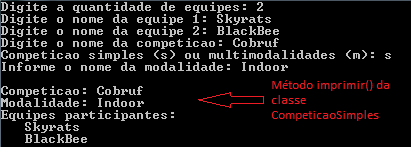
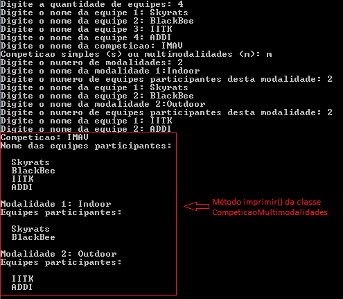

# Exercício de OO - "MiniEP"

## Introdução

Esse exercício tem como intuito treinar as habilidades mais essenciais para a programação orientada a objeto. A princípio, o código pedido poderia ser feito de forma muito mais simples, mas como o objetivo é a aprendizagem de conceitos importantes, o foco não é a otimização do código.

Esse “Mini EP” na verdade é uma adaptação do EP2 proposto pela disciplina “PCS3111 - Laboratório de Programação Orientada a Objetos” no segundo semestre de 2019. Neste EP original, eram pedidas classes adicionais para cálculos de pontos e persistência de arquivos (além de o tema não ser de Drones, infelizmente...). Decidimos não cobrar essas classes adicionais porque demandaria muito tempo e não seria tão necessário. 

Neste “Mini EP”, é pedido para que se elabore um software para gerenciar competições de Drones. Nele, o usuário insere as informações sobre uma competição de drones, tais como quantidade de equipes, nome das equipes e modalidades diferentes. O software deve organizar essas informações e printar no terminal ao final do programa.

## Classes:

* **Equipe;**
* **Modalidade;**
* **Competicao;**
* **CompeticaoSimles;**
* **CompeticaoMultimodalidades;**

## Implementação das classes

### 1. Equipe

Esta classe deve receber o nome de uma equipe e possuir os métodos públicos:

```c++
Equipe(string nome);
virtual ~Equipe();
virtual string getNome();
virtual void imprimir();
```

* O método **"Equipe(string nome)"** é o construtor e **“~Equipe()”** o destrutor da classe;
* O método **“getNome()”** deve retornar uma string com o nome da Equipe;
* O método **“imprimir()”** deve printar no terminal da seguinte forma:

*Equipe: <nome da equipe>*

### Modalidade:

No caso de uma competição de Drones, podemos considerar 2 tipos mais comuns de modalidades: “Indoor” e “Outdoor”. Em competições como a IMAV, as equipes podem escolher participar somente de uma modalidade ou das duas modalidades.

Esta classe deve receber o nome de uma equipe e possuir os métodos públicos:

```c++
Modalidade(string nome, Equipe** participantes, int quantidade);
virtual ~Modalidade();
virtual string getNome();
virtual Equipe** getEquipes();
virtual int getQuantidadeDeEquipes();
```

* O método **“getNome()”** deve retornar o nome da Modalidade (passado como parâmetro para a função);

* O método **“getEquipes()”** deve retornar o vetor com as equipes que estão participando desta modalidade;

* O método **“getQuantidadeDeEquipes()”** deve retornar um inteiro com a quantidade de equipes participantes;

### Classe Competicao:

Existem vários tipos de competições de drones, por exemplo: IMAV, Cobruf Drones, Drone racing etc. Mas nem sempre tais competições possuem as modalidades “Indoor” e “Outdoor”, elas podem possuir somente uma dessas ou até mais que três tipos de modalidades diferentes.

Por conta disso, as competições podem ser “Simples” (somente um tipo de modalidade) ou “Multimodalidades”. Assim, esta classe (“Competição”) deve ser abstrata, já que alguns métodos são iguais para os dois tipos de competição e outros não.

Você deve decidir quais / qual método deve ser abstrato de acordo com o que é pedido.

Esta classe deve receber o nome de uma equipe e possuir os métodos públicos:

```c++
Competicao(string nome, Equipe** equipes, int quantidade);
virtual ~Competicao();
string getNome();
Equipe** getEquipes();
int getQuantidadeDeEquipes();
virtual void imprimir();
```

* O método **“getNome()”** deve retornar o nome da competição;

* O método **“getEquipes()”** deve retornar o vetor das equipes participantes;

* O método **“getQuantidadeDeEquipes() ”** deve retornar a quantidade de equipes desta competição.

* Se for uma competição multimodalidades, o  método **“imprimir()”** deve printar no terminal da seguinte forma:

Competicao: <Nome da competição>
Nomes das equipes participantes: 

       <Equipe1>
          |
    <Equipe(Total)>

Modalidade 1: <Modalidade 1>
Equipes participantes:

     <Equipe1>
         |
     <EquipeN>

Modalidade x: <Modalidade x>
Equipes participantes:

    <Equipe1>
        |
    <EquipeM>
	
* Caso seja uma competição simples:

Competicao: <Nome da competição>
Modalidade: <Modalidade >
Equipes participantes:
    <Equipe1>
        |
    <EquipeN>
	
### Classe CompeticaoSimples:

A CompeticaoSimples é um subtipo de Competicao em que só há uma Modalidade. Note que agora o construtor deve possuir um argumento a mais, a modalidade. Com isso, ela deve ter os seguintes métodos públicos específicos a essa classe (e eventuais métodos que foram definidos como abstratos em Competicao):

```c++
CompeticaoSimples(string nome, Equipe** equipes, int quantidade, Modalidade* m);
virtual ~CompeticaoSimples();
Modalidade* getModalidade();
```

* O método *“getModalidade()”* deve retornar a única modalidade desta competição.

### CompeticaoMultimodalidades:

A CompeticaoMultimodalidades é um subtipo de Competicao em que é possível ter várias Modalidades. Para permitir a adição das modalidades, será usado um list, da biblioteca padrão. Com isso, ela deve ter os seguintes métodos públicos específicos a essa classe (e eventuais métodos que foram definidos como abstratos em Competicao):

```c++
CompeticaoMultimodalidades(string nome, Equipe** equipes, int quantidade);
virtual ~CompeticaoMultimodalidades();
void adicionar(Modalidade* m);
list<Modalidade*>* getModalidades();
```

* O método **“adicionar(Modalidade* m)”** deve adicionar a modalidade m a uma lista de modalidades;

* O método **“getModalidades()”** deve retornar a lista de modalidades adicionadas.

### Main:

A ** Main() ** deve pedir as informações necessárias para armazenar as informações e depois chamar o método **imprimir()** das classes **CompeticaoSimples()** e **CompeticaoMultimodalidades**.

Um exemplo do terminal com as infromações pedidas e a resposta dos métodos pode ser visto a seguir:

#### Terminal para uma competição simples:



#### Terminal para uma competição multimodalidades:

