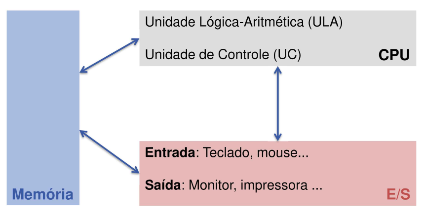
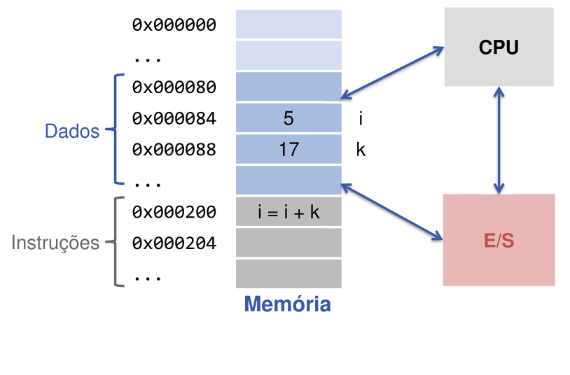

# STW3100


## Linguagens de Programação
_"...conjunto de regras sintáticas e semânticas, de implementação de um código fonte."_ - Prof. Dr. Wikipedia
Java, C, C++, C#, Python, Javascript, PhP... **Qual a diferença?**


Mas como a máquina pega essas instruções em alto nível que foram digitadas, e as executa?

### Principais abordagens: 
* Compilação - C, C++, C#, Java
    * Há um **compilador** (um programa), que lê o texto do seu código, sabendo das regras de sintaxe da linguagem, e o traduz para um arquivo em código de máquina.
    * Na prática, desenvolvendo em linguagens compiladas, sempre que quisermos rodar o que está sendo escrito, precisamos compilar. 
* Intepretação - Pyhton, PHP, JavaScript, Ruby
    * Há um... **interpretador** (outro programa), que lê, linha por linha de código da linguagem interpretada, e executa o comando **enquanto faz a leitura**.
    * Cruamente, as linguagens interpretadas são conhecidas por terem uma performance pior que as compiladas, porém existem técnicas para contornar isso.
* Outros...
    * Just-in-time compilation [olha q belezinha](http://numba.pydata.org/)
    * Structured programming


### Paradigmas de Programação
* Imperativo

* Orientado a Objetos (OO)

* Orientado a Eventos

* Declarativo, Estrutural e muitos outros

## O C++

C++ foi desenvolvido por Bjarne Stroustrup at Bell Labs in 1979, com o objetivo de ser uma extensão à linguagem C.

Ele pode ser usado para criar aplicações de alta performance e ao mesmo tempo permite um alto nível de controle dos recursos do sistema e memória aos programadores.

Por que usamos C++?

Sendo uma das liguagens de programação mais utilizadas, tão usada que é geralemnte encontrada em sistemas operacionais, GUI's (Graphical User Interface) e sistemas embarcados. Ele também é uma linguagem orientada à objetos, dandn uma estrutura bem definida para programas e permitindo o reuso de códigos, diminuindo custos de desenvolvimento.

Como o C++ se aproxima bastante de linguagens como C# e Java, é relativamente fácil para programadores incalar entre essas linguagens

### Variáveis - Estruturas de Dados Fundamentais
#### Tipos

| Tipo de variável | Tamanho | Range |
| --------- |:--------:| :----------:|
|   bool    |   1 bit  |
|    char   |   1 byte |
|    int    |  4 bytes | 	-2,147,483,648 to 2,147,483,647 |
|unsigned int | 4 bytes | 0 to 4,294,967,295 |
|float|4 bytes|1.175494e-38 a 3.402823e+38 (**8.5677e+14 mols**)|
|double|8 bytes|-inifinito a +infinito|
|void|||
|string|||

* Não existem números reais em sistemas digitais, um float é feito de ints!
    * 24 dígitos de mantissa
    * 7 bits pro expoente

#### Declaração
Em C++, precisamos **declarar** as variáveis, e seus tamanhos devem ser, a priori, definidos para que a máquina aloque a memória necessária para as variáveis.

```C++
int contador;
int contador = 0;
```
### PONTO E VIRGULA, SEMPRE!
Quando definimos uma variável o seu conteúdo não é conhecido, então é uma boa prática **inicializar as variáveis antes do seu uso**.
#### Uso
* Operadores
    * Soma - `+`
    * Subtração - `-`
    * Produto - `*`
    * Divisão - `/`
    * Negação - `!`
    * AND - `&&`
    * OR - `||`
    * Comparação `>=`, `<=`, `==`

* Variáveis numéricas
```C++
int C=0; // inicializando a variável

//Jeito 1 de incrementar variáveis
C = C + 1;
//Jeito equivalente
C++;
//Jeito equivalente
C += 1;

//O mesmo vale para subtrações, produtos e divisões
C = C - 1;
C--;
C -= 1;
// São 3 modos equivalentes de fazer a mesma operação
```
* Variáveis booleanas
```C++
bool decision = false; // inicializando a variável

decision != decision;
// Depois dessa operação, decision vale true
```
```C++
bool verao, chuva;

sair = verao && !chuva; // sair, se for verão e não houver chuva

if(sair) {
    /* . . . */
}
```
Booleanos a partir de comparações
```C++
float altura;

/* . . . */

bool pousou;
pousou = (altura <= 0.3);

if (pousou) {
    desarmar(drone); // Meramente ilustrativo rs
}
else {
    // desarma não, tio
}
```

### Entrada e Saída básicas
Para lidar com entradas e saídas básicas, podemos usar a biblioteca iostream. 

```C++
import <iostream>
using namespace std;

int main() {
    int entrada;
    
    cin >> entrada;
    cout << "A entrada foi" << entrada << endl;

    return 0;
}
```

~~Na prática, não usaremos muito entradas pelo terminal, e as saídas idealmente são feitas com o ROS na maioria dos nossos programas.~~


#### Hello, drone

### Blocos de Código

​	Blocos de código são conjuntos de instruções separados geralmente por `{ }`. Os que estudaremos aqui são alguns tipos de blocos **Condicionais**, **Loops** e **Funções**.

#### Condicionais

​	Para executarmos este tipo de bloco precisamos de uma condição. Geralmente é uma expressão que possui um resultado booleano (veradeiro ou falso).  Para realizar essa tarefa em linhas de código usamos o comando **if**.

**Sintaxe:**

```C++
if(<condição>) {
	<comando1>;
	<comando2>;
		...
}
```

​		Assim, os comandos apresntados apenas serão executados se a <condição> for verdadeira.

​		Podemos também acrescentar comandos em caso de a condição não seja satisfeita. Para isso usamos o comando **else**.

**Sintaxe:**

```C++
if(<condição>) {
<comando1>;
<comando2>;
	...
}

else {
<outro_comando1>;
<outro_comando2>;
	...
}
```


**Obs:** Caso apenas exista 1 comando a ser executado dentro do **if** ou do **else** pode-se remover oscolchetes `{ }`.


### Loops

​	Loops são estruturas cuja função é repetir o mesmo bloco de código até que uma determinada condição seja satisfeita. Os comandos mais comuns  são **for**, **while** e **do while**. Veremos como os três funcionam.


#### 	while

​		Enquanto uma dada condição for verdadeira esse bloco de código irá se repetir. Tome cuidado para não criar loops infinitos com condições que nunca se tornarão falsas.

​	**Sintaxe:**

```C++
while(<condição>) {
<comando1>;
<comando2>;
	...
}
```

#### 	

#### 	do while

​		Funciona de maneira semelhante ao **while**, mas a verificação da condição é realizada no final do loop, e não no início como no comando anterior. Assim, a primeira iteração (repetição) sempre irá ocorrer independente da condição.

**Sintaxe:**

```C++
do {
<comando1>;
<comando2>;
	...
} while (<condição>);
```

#### 	

#### 	for

​		Muitas vezes usamos um contador como condição para a interrupção de um loop. Quando nos deparamos com esse tipo de situação é convencional usarmos o laço de repetição **for**.

**Sintaxe:**

```C++
for(<inicialização_do_contador>; <condição_do_contador>; <atualização_do_contador>){
<comando1>;
<comando2>;
	...
}
```

​		Geralmente usamos uma variável inteira que chamamos de `i` para o contador, inicializando-a com o valor `0` e somando `1` em cada iteração, ficando assim:

```C++
for (int i = 0; <condição>; i++){
<comando1>;
<comando2>;
	...
}
```


```C++
for (auto& x : foo().items()) { /* .. */ }
```

#### Fatorial

### Funções

### Arrays

### Ponteiros

Antes de entendermos de fato os *Ponteiros* vamos mostrar melhor como um computador funciona esquematicamente. A arquitetura mais conhecida que descreve o funcionamento básico de um computador que é utilizada até hoje é a **Arquitetura de von Neumann**:

<div align="center"></div>

Mais detalhadamente poderiamos ilustrar a memória separada em seus respectivos endereços, onde cada endereço pode armazenar um valor qualquer ou uma instrução:

<div align="center"></div>

Um ponteiro é uma variável capaz de armazenar um endereço de memória ou o endereço de outra variável.

<div align="center"></div>

Podemos nos referir à *Ponteiros* como "Apontadores", pois eles apontam para endereços de memória.

#### Declaração

```c++
<Tipo> *p;
```

```c++
int *p1;
double *p2;
```

#### Operador *&*

O operador **&** obtém o endereço de uma variável.

```c++
#include <iostream>

using namespace std;

int main(){

    int i = 100;        // inicializa a variavel i
    double j = 5.5;     // inicializa a variavel j

    cout << &i << endl;     // imprime "0x6afef4"
    cout << &j << endl;     // imprime "0x6afef8"

    int *p1;        // inicializa o ponteiro p1
    double *p2;     // inicializa o ponteiro p2

    p1 = &i;        // atribui o endereco da variavel i ao ponteiro p1 
    p2 = &j;        // atribui o endereco da variavel j ao ponteiro p2

    cout << p1 << endl;     // imprime "0x6afef4" pois p1 aponta para i
    cout << p2 << endl;     // imprime "0x6afef8" pois p2 aponta para j

    return 0;
}
```

Observando o programa acima, notamos que podemos acessar os endereços de memória das variáveis com o operador *&*, e é por isso que sempre que formos atribuir endereços de memórias à ponteiros precisamos utilizar este operador.

#### Operador *

O operador <strong>*</strong> permite obter o valor apontado pelo ponteiro

```c++
#include <iostream>

using namespace std;

int main(){
    int i  = 5;
    int *p = &i;

    cout << i << endl;      // imprime "5"
    cout << *p << endl;     // imprime "5" por ser o valor do endereco que o ponteiro armazenou

    // tambem e possivel usa-lo para alterar o valor do endereco apontado

    *p = 10

    cout << *p << endl;
    cout << i << endl;

    return 0;
}
```

#### NULL

O NULL está definido em várias bibliotecas e ele representa "nenhum" valor ou o valor "nulo".

```c++
#include <iostream>

using namespace std;

int main(){
    int *p2;
    p2 = NULL;

    if(p2 == NULL){
        cout << "Null" << endl;
    }

    return 0;
}
```

O NULL está definido em `<iostream>`.

</br>

***Obs:** É possível ter ponteiros de ponteiros:

```c++
#include <iostream>

using namespace std;

int main(){
    int i = 100;
    int *p1 = &i;

    int **p2;
    p2 = &p1;

    cout << i << end;       // imprime "100" que e o valor de i
    cout << *p1 << endl;    // imprime "100" que e o valor que esta no endereco apontado por p1
    cout << **p2 << endl;   // imprime "100" que e o valor apontado pelo apontador apontado por p2
}
```

<div align="center"></div>

****Obs:** É possível ter mais de um ponteiro apontando para o mesmo valor

</br>

Um vetor funciona como um ponteiro. A variável aponta para a primeira posição do vetor.

```c++
#include <iostream>

using namespace std;

int main(){
    int a1[] = {1, 2, 5};
    int *p = a1;

    cout << p[0] << endl;       // imprime "1"
    cout << p[2] << endl;       // imprime "5"
}
```

<div align="center"></div>

> Em C++ não é possível retornar vetores. Mas é possível retornar um ponteiro.

#### Bhascara - retornar 2 raizes

### Recursão

#### Fatorial++

### Usando Bibliotecas

#### Subtração de 2 imagens, usando OpenCV