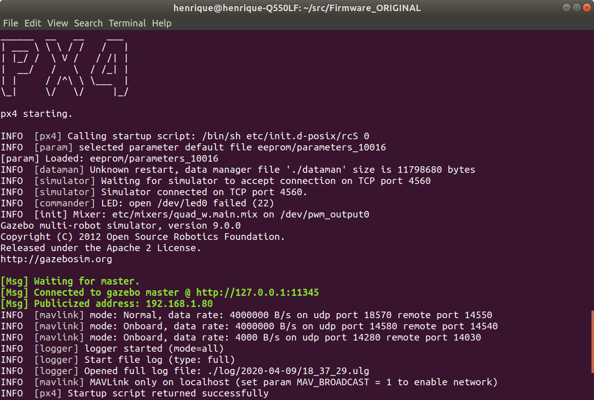
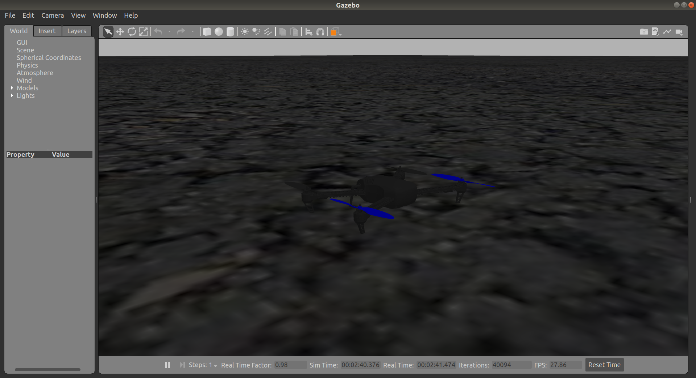

# Operação (e simulação) de drones

Digamos que nós temos um drone. Todos os seus componentes estão instalados, o Firmware da PX4 está compilado na Pixhawk, e a bateria está carregada. Ele está pronto para voar! Mas... como fazemos para decolar o drone? Como fazemos para controlá-lo? Nesse workshop, vamos aprender como operar um drone, seja ele físico ou simulado. Vamos cobrir também como simular um drone no seu PC ~pra o caso de estarmos de quarentena, por exemplo~.

## **Etapa 0:** Instalações

Antes de começar, precisamos que vocês já tenham algumas coisas instaladas no computador:
- Firmware PX4
- QGroundControl
- ROS
- Gazebo
- mavros

Para instalar tudo isso, rode o script `skyrats_setup.sh` presente nessa pasta. Basta abrir o terminal na pasta em que o script estiver baixado e digitar `source skyrats_setup.sh`

## **Etapa 1:** Inicializando o drone

### Ligando o drone (físico)

#TODO: fazer o passo a passo

### Abrindo o simulador

Vamos executar o PX4 no modo **simulação do tipo SITL (Software In The Loop)**, ou seja, todo o PX4 estará rodando na nossa máquina. Em um drone físico, ele estaria rodando na Pixhawk, que possui memória e processamento mais limitados, mas o SITL reproduz todos os componentes do sistema.

Por cima do PX4, estaremos utilizando o **Gazebo**, um simulador poderoso construido para aplicações de robótica. Se você quiser saber mais sobre ele, clique [aqui](http://gazebosim.org/).

Para iniciar a simulação, compilamos o firmware no modo SITL como gazebo:
```
cd ~/src/Firmware
make px4_sitl gazebo
```
*A primeira vez que executamos isso demora um pouco, porque estamos compilando todo o firmware*

O terminal vai vomitar um monte de texto sobre a compilação, e em algum momento ele vai ficar parecido com isso:



Esse é essencialmente o terminal do PX4. É nele que são publicadas as mensagens, informações, avisos, e outros. Vemos, por exemplo, informações publicadas por [simulator], [mavlink] e [logger]. Enquanto a simulação estiver ligada, esse terminal vai estar nos comunicando sobre o drone.

Além disso, o Gazebo também iniciou, mostrando uma tela como essa:



Infelizmente, o drone fica quase da mesma cor do chão, e é muito difícil vê-lo :(.

Isso foi tudo usando as configurações padrão, mas podemos explorar mais um pouco o que o px4_sitl e o gazebo podem fazer.

#TODO: explorar e explicar as configurações da simulação; explicar o funcionamento interno da simulação.

## **Etapa 2:** QGC

Certo, agora que o drone está ligado, vamos introduzir uma ferramente importante: a **QGroundControl**. A QGC é um programa de controle de voo e planejamento de missões. Ela é nossa **Ground Control Station (Estação de controle de solo)**, isto é, ela roda em nosso computador (no solo) para controlarmos o drone e visualizarmos o que está acontecendo com ele.

O script da Etapa 0 instala a QGC na sua home, então basta ir até ela e clicar no ícone (alternativamente, podemos abri-la com um terminal com `~/QGroundControl.AppImage`).

Ao abrir a QGC, ela irá se conectar automaticamente ao drone, e mostrará uma tela parecida com essa:

 

Naturalmente, se o seu drone não estiver ligado e conectado ao seu computador, a tela vai estar um pouco diferente, e algumas opções não estarão disponíveis.

A barra superior tem vários itens interessantes. Os 5 primeiros ícones **alternam entre as vistas (Views)**. Eles são:
-  *Settings*: abre a vista de configuração **da QGroundControl**.
-  *Setup*: abre a a vista de configuração **do drone**
-  *Plan*: abre a vista de planejamento, que te permite traçar missões autônomas.
    - Note que a autonomia dessas missões envolve basicamente movimentar o drone, especialmente com base em dados de GPS. Para missões mais elaboradas, e que requerem integração com outros sistemas, iremos precisar do ROS.
-  *Fly*: É a vista padrão quando abrimos a QGC. Mostra o mapa com a localização do drone, informações sobre seu estado e algumas ações. É possível reproduzir o feed de vídeo do drone nessa vista.
-  *Analyze*: abre a vista de análise, que permite baixar logs de voo e acessar o console MAVLink.

Depois desses, vemos alguns ícones que indicam o estado do drone, como GPS, telemetria, RC, bateria, e modos de voo. Pra ver detalhes, basta passar o mouse por cima deles.

#TODO: Fazer algo no Setup e/ou com a pxh shell

Vamos ficar na aba **Fly** e brincar um pouco com o drone. No canto superior direito, vemos dois círculos que mostram a orientação do drone. O da direita é uma bússola, e o da esquerda indica a orientação do drone com relação a roll e pitch. Logo embaixo deles, temos uma aba bastante versátil para ver informações sobre o drone (clique na seta do lado direito ou na engrenagem do lado esquerdo para mais opções)

Vamos dar uma voltinha com o drone:
1. **Takeoff:** clique no botão takeoff, coloque a altitude desejada na barra vertical no canto direito e deslize o slider na parte de baixo da tela. Vamos começar decolando para uma **altitude de 10.0m**.
    - Note como inicialmente a QGC muda o indicador de Disarmed para Armed, e como a altitude vai aumentando até estabilizar ao redor de 10m.
    - Note como o modo de voo, que inicialmente estava em Hold, muda para Takeoff e depois de volta para Hold.
    - Volte e olhe para o Gazebo. Você vai ver que o drone também decolou lá (mesmo que o cenário seja um pouco diferente)  
2. Clique em algum ponto do mapa e selecione **Go to location** para ir até lá.
3. **Land:** Aperte o botão de land e deslize o slider novamente para pousar seu drone.

Vamos experimentar as missões:

1. Abra a vista de planjamento de missões e selecione a missão *Blank* (vamos montar a missão do zero, mas existem algumas missões mais comuns, como varrer uma área, etc.).
2. Adicione um **takeoff**, e mude a altitude para 10m.
    - **As etapas de sua missão são mostradas em uma lista do lado direito da tela**. Clique em qualquer uma para acessar suas opções.
3. Agora, vamos adicionar alguns **waypoints**. Basta selecionar essa opção do lado esquerdo e ir adicionando no mapa os pontos que você quer que o drone visite, em ordem. Você pode até arrastar pontos que já foram criados.
4. Com o último ponto selecionado, adicione um **Return**, que basicamente garante que seu drone vai voltar exatamente para onde ele decolou ao final da missão.
5. Dê upload da missão para o drone (em um drone físico, isso significa literalmente transmitir as instruções do seu PC para serem armazenadas pela Pixhawk)
6. Volte para a vista **Fly** e deslize o slider para começar a missão.

## **Etapa 3:** mavros

Agora que conseguimos voar com o drone e realizar missões simples, podemos fazer coisas mais complexas. Para isso, precisamos integrar nosso drone com o [ROS](http://wiki.ros.org/). O ROS é o sistema utilizado para integrar vários componentes do nosso drone, e permitir o controle autônomo tanto onboard quanto offboard.

O drone, e a estrutura do PX4, é representado no ROS como

```
roslaunch mavros px4.launch fcu_url:="udp://14540@127.0.0.1:14557"
```


## Exercícios extra

1. Usando o planejador de missões da QGroundControl, elabore uma [MISSÃO ESPECÍFICA AQUI]

## Referências
1. [Simulation - PX4 Developer Guide](http://dev.px4.io/master/en/simulation/)
2. [Gazebo](http://gazebosim.org/)
3. [QGroundControl](http://qgroundcontrol.com/)
