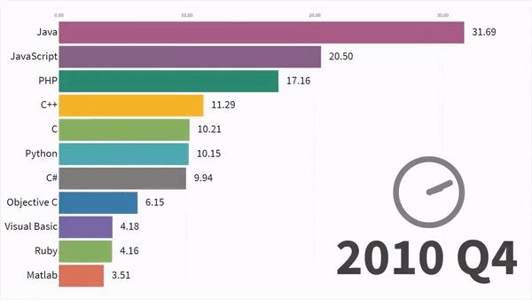

# STW3100


## Linguagens de Programação
_"...conjunto de regras sintáticas e semânticas, de implementação de um código fonte."_ - Prof. Dr. Wikipedia
Java, C, C++, C#, Python, Javascript, PhP... **Qual a diferença?**


Mas como a máquina pega essas instruções em alto nível que foram digitadas, e as executa?

### Principais abordagens: 
* Compilação - C, C++, C#, Java
    * Há um **compilador** (um programa), que lê o texto do seu código, sabendo das regras de sintaxe da linguagem, e o traduz para um arquivo em código de máquina.
    * Na prática, desenvolvendo em linguagens compiladas, sempre que quisermos rodar o que está sendo escrito, precisamos compilar. 
* Intepretação - Pyhton, PHP, JavaScript, Ruby
    * Há um... **interpretador** (outro programa), que lê, linha por linha de código da linguagem interpretada, e executa o comando **enquanto faz a leitura**.
    * Cruamente, as linguagens interpretadas são conhecidas por terem uma performance pior que as compiladas, porém existem técnicas para contornar isso.
* Outros...
    * Just-in-time compilation [olha q belezinha](http://numba.pydata.org/)
    * Structured programming


### Paradigmas de Programação
* Imperativo

* Orientado a Objetos (OO)

* Orientado a Eventos

* Declarativo, Estrutural e muitos outros

## O C++

### Variáveis - Estruturas de Dados Fundamentais
#### Tipos

| Tipo de variável | Tamanho | Range |
| --------- |:--------:| :----------:|
|   bool    |   1 bit  |
|    char   |   1 byte |
|    int    |  4 bytes | 	-2,147,483,648 to 2,147,483,647 |
|unsigned int | 4 bytes | 0 to 4,294,967,295 |
|float|4 bytes|1.175494e-38 a 3.402823e+38 (**8.5677e+14 mols**)|
|double|8 bytes|-inifinito a +infinito|
|void|||
|string|||

* Não existem números reais em sistemas digitais, um float é feito de ints!
    * 24 dígitos de mantissa
    * 7 bits pro expoente

#### Declaração
* 
#### Uso

### Entrada e Saída básicas

#### Hello, drone

### Condicionais
#### if/else

### Loops
#### while

#### for

```C++
for (auto& x : foo().items()) { /* .. */ }
```

#### do ... while


#### Fatorial

### Funções

### Arrays

### Ponteiros

#### Bhascara - retornar 2 raizes

### Recursão

#### Fatorial++

### Usando Bibliotecas

#### Subtração de 2 imagens, usando OpenCV