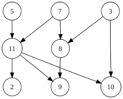
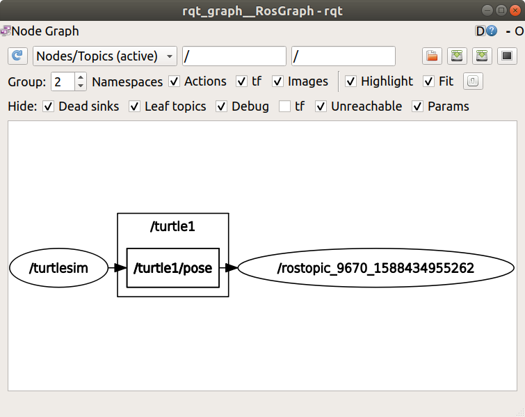

# Introdução ROS2
Antes de começar esse tutorial, **o que é ROS2 e por que você, membro da Sky, ouvirá tanto dele nos próximos anos**. ROS2 ou *Robot Operating System* é um conjunto de bibliotecas e ferramentas que ajudam em aplicações robóticas, no nosso caso, de drones. Dessa maneira, o ROS é um sistema *open source* que ajuda na definição de interfaces, ferramentas e componentes de um robô, deixando mais fácil a construção, junção das diferentes partes e também a manipulação de dados (não do seu Instagram, mas dos Logs dos drones).

Além disso, **é possível usá-lo em simulações (aguardem pelo Gazebo) e depois no drone de verdade**. ROS2 funciona como uma combinação de workspaces, usando a técnica de conchas (shells). O workspace “principal” é o *underlay*, a camada mais baixa que faz a base do programa, as outras são os *overlays*, que complementam a principal. O sistema de *shells* funciona para que seja possível ter diferentes distros do ROS no mesmo computador, assim, a distro necessária só funcionará quando ela for chamada, criando uma *shell* para tal e habilitando os comandos do ROS.

## Pré Requisitos
1. Ubuntu instalado
2. ROS2 instalado
3. Workshop de Linux
4. Preferir gatos (NÃO OPCIONAL)

## ROS 2 por grafos?

O funcionamento do ROS é representado por um **grafo**, que organiza a interação entre os programas através de topics, services e actions.



Grafos são estruturas muito utilizadas na computação e na matemática, e consistem em um conjunto de **vértices** ou **nós**, ligados por **arestas**. Na prática, eles funcionam como uma forma de abstração, isto é, uma forma de compreender e modelar um sistema. No caso do ROS, o grafo representa a comunicação: os nós são os programas (nodes), e as arestas representam vias de comunicação (topics, services e actions) entre eles.

## Começando com ROS 2
Para iniciar a shell do ROS 2, sempre é necessário rodar:

```
source /opt/ros/galactic/setup.bash
```

Caso você não queira ter esse trabalho (recomendado), abra seu bash com:

```
nano ~/.bashrc 
```

Vá até o final do bash e adicione:

```
source /opt/ros/galactic/setup.bash
```

Aperte `CTRL+S` e `CTRL+X` para salvar e sair.
Para verificar se seu ROS 2 está *settado* propriamente, coloque:

```
printenv | grep -i ROS
```

Então veja se a distro (em 03/2021 estamos usando o *galatic*) e a versão estão corretas. 

## Uma primeira simulação

Nesse primeiro contato conheceremos o `/turtlesim`, que é um simulador básico e de aprendizado do ROS, além de rqt que é uma GUI (interface gráfica) que facilita a manipulação de elementos do ROS 2, apesar de tudo poder ser feito pelo terminal.

Primeiro baixe os arquivos da  `/turtlesim`:

```
sudo apt install ros-galactic-turtlesim
```

Rode o `/turtlesim` (cada vez que o `/turtlesim` é aberto, tem uma tartaruguinha diferente):

```
ros2 run turtlesim turtlesim_node
```

Já em um novo terminal, rode: 

```
ros2 run turtlesim turtle_teleop_key
```

Com esse novo terminal você pode usar as setas para controlar a tartaruga. Além disso, é possível ver os… **nodes? services? topics? e actions?** associadas ao simulador com os códigos

```
ros2 node list
ros2 topic list
ros2 service list
ros2 action list
```

Mas o que são todos esses itens? Na verdade, eles são a base de como os programas rodam em ROS e cada um deles será aprofundado nos próximos instantes, por enquanto vemos apenas que o ROS funciona. Jajá veremos o que está por trás dessa interface de tartaruga e que futuramente, nós estaremos programando.

Agora sobre o rqt, instale-o com: 

```
sudo apt install ~nros-galactic-rqt*
```
Para rodar, simplesmente: 

```
rqt
```

Selecione  *Plugins > Services > Service Caller* na barra de menu, clique no botão de refresh e então nas opções de services, selecione o `/spawn`, mude o nome da tartaruga para *skypet* e seu *x* e *y* para 1.0, para rodar service, clique no botão **call**. 

Ao dar outro refresh, haverá services associados tanto a *turtle1* quanto a *skypet*. Você pode alterar características do rastro deixado pela tartaruga 1 ao usar o service */set_pen*.

Vamos mover a *skypet*, em um novo terminal, rode: 

```
ros2 run turtlesim turtle_teleop_key --ros-args --remap turtle1/cmd_vel:=skypet/cmd_vel
```

Agora é possível mover a *skypet* enquanto o terminal estiver ativo (você acabou de remapear o cmd_vel da tartaruga inicial). Para finalizar o simulador de `CTRL+C` em todos os terminais. 

### Nodes (as casas)

Lembra daqueles nomes estranhos que falamos antes, agora é a hora de nos aprofundarmos com eles. A começar pelos **nodes**, eles são como **casas**, que podem receber ou mandar informações para outras, só que quem leva os dados não são elas. Nodes têm uma função modular, de propósito único (um node controla os motores das hélices, outro controla a câmera do drone). Cada node pode receber e mandar informações através de topics, services, actions e parameters.

#### ros2 run 

É o comando que roda um executável, com a estrutura `ros2 run <package_name> <executable_name>`. Como exemplo, temos o `/turtlesim` rodado anteriormente: 

```
ros2 run turtlesim turtlesim_node
```

#### ros2 node list

Mostra uma lista dos nodes ativos:

```
ros2 node list
```

Caso você tenha rodado o turtlesim, aparecerá: 

```
/turtlesim
```

Ao rodar o `ros2 run turtlesim turtle_teleop_key` e o `ros2 node list`, aparecerá:

```
/turtlesim
/teleop_turtle
```

Se você remapear, como fizemos ao mudar o controle para a skypet, podemos abrir outro simulador com um nome diferente: 

```
ros2 run turtlesim turtlesim_node --ros-args --remap __node:=sky_turtle
```

Gerando assim, 3 nodes:

```
/sky_turtle
/turtlesim
/teleop_turtle
```

#### ros2 node info

É acessado por `ros2 node info <node_name>`. Examinando a sky_turtle:

```
ros2 node info /sky_turtle
```

Essa ação retornará os *subscribers, publishers, services e actions* que interagem com o node, inclusive o `/spawn`, que usamos anteriormente.

### Topics (Onibus)

Os topics são essenciais e fazem a troca de mensagens entre nodes, eles são como os onibus que levam dados de um lugar a outro. Sendo que os topicos não funcionam numa rota única, ele pode ir de um node para vários. de vários para um e de vários para vários.

Abra o `/turtlesim` em um terminal e, em outro, abra o node de movimentação da tartaruga. Além disso, rode:

```
rqt_graph
```

Isso abrirá um gráfico de comunicação do `/turtlesim`, caso você coloque o mouse em cima do topic central, isso o deixará colorido, como na imagem abaixo. O node `/teleop_turtle` envia mensagens que são recebidas pelo `/turtlesim` através do topic `/turtle1/cmd_vel`.



#### ros2 topic list

Ao rodar `ros2 topic list`, será retornado os topics relacionados ao sistema ativo:

```
/parameter_events
/rosout
/turtle1/cmd_vel
/turtle1/color_sensor
/turtle1/pose
```

Caso rode `ros2 topic list -t`, o tipo do topic aparecerá também:

```
/parameter_events [rcl_interfaces/msg/ParameterEvent]
/rosout [rcl_interfaces/msg/Log]
/turtle1/cmd_vel [geometry_msgs/msg/Twist]
/turtle1/color_sensor [turtlesim/msg/Color]
/turtle1/pose [turtlesim/msg/Pose]
```

#### ros2 topic echo

Para ver quais informações um topic está publicando, a base é `ros2 topic echo <topic_name>`, Para o turtlesim: 

```
ros2 topic echo /turtle1/cmd_vel
```

Caso você volte para o terminal que movimenta a tartaruga, quando começar a movimentá-la, o `ros2 topic echo` publicará a nova posição para cada movimento da tartaruga.

No rqt_graph, desmarque a opção de Debug, isso mostrará um novo node ligado ao `cmd_vel`. que é o node criado pelo echo para os prints de mudança da tartaruga.

#### ros2 topic info

Para mais informações sobre um topic, é possível rodar:

```
ros2 topic info /turtle1/cmd_vel
```

Retornando assim seu tipo, quantidade de publishers (enviam a mensagem)  e subscribers (recebem a mensagem).

#### ros2 interface show

Mostra para mais informações sobre o tipo da mensagem do topic, para isso usa-se o **ros2 interface show**, seguido pelo tipo da mensagem, para o cmd_vel: 

```
ros2 interface show geometry_msgs/msg/Twist
```

Se o print estiver certo, ele mostrará um vetor angular e um linear, ambos com 3 parâmetros cada.

#### ros2 topic pub

Permite publicar informações em topics direto do terminal, com a estrutura `ros2 topic pub <topic_name> <msg_type> '<args>'`. Para o cmd_vel, temos (os args devem ser colocados em sintaxe YAML ): 

```
ros2 topic pub --once /turtle1/cmd_vel geometry_msgs/msg/Twist "{linear: {x: 2.0, y: 0.0, z: 0.0}, angular: {x: 0.0, y: 0.0, z: 1.8}}"
```

--once é opcional e significa para publicar a mensagem e depois sair. Para rodar de forma constante usa-se o --rate seguido de um número (frequência que será publicado em hz), por exemplo:

```
ros2 topic pub --rate 1 /turtle1/cmd_vel geometry_msgs/msg/Twist "{linear: {x: 2.0, y: 0.0, z: 0.0}, angular: {x: 0.0, y: 0.0, z: 1.8}}"
```

#### ros2 topic hz 

Mostra a frequência que um topic é publicado, teste: 

```
ros2 topic hz /turtle1/pose
```

Feche tudo antes de ir para o próximo item, se não começa a ficar confuso.

### Services (correio)

Enquanto topics eram baseados em um **modelo publisher-subscriber**, services funcionam de maneira  call-and-response, os topics publicam atualizações constantemente, ja os services publicam apenas quando são chamados. Vários nodes podem usar um service, mas só existe um servidor para cada service. Dessa maneira, enquanto os topics eram ônibus que faziam entrega mais específicas, services seriam como um sistema de correio que recebe dados e repassa para outras casas (nodes).

#### ros2 service list
Abra o `/turtlesim` e `/teleop_turtle`, agora se você rodar `ros2 service list` aparecerá todos os services ativos associados ao `/turtlesim`, inclusive o `/spawn`, que usamos anteriormente. 

#### ros2 service type

Para descobrir o tipo de um service, o comando base é `ros2 service type <service_name>`. Use `/clear` como exemplo:

```
ros2 service type /clear
```

Também é possível usar `ros2 service list -t`, assim todos os services aparecem com o seu tipo ao lado. 

#### ros2 service find

Caso seja necessário o processo inverso, é possível descobrir os services ligados a um tipo com a base `ros2 service find <type_name>`. Use o tipo do /clear como exemplo:

```
ros2 service find std_srvs/srv/Empty
```

Assim como os topics, é possível chamar o service pelo terminal, use o `ros2 interface show` para conhecer a estrutura do input. Se o tipo for empty, ele não tem dados para receber ou enviar, porém o `/spawn` tem, logo, teste:

```
ros2 interface show turtlesim/srv/Spawn
```

O que retorna: 

```
float32 x
float32 y
float32 theta
string name # Optional.  A unique name will be created and returned if this is empty
---
string name
```

A parte acima do --- é o que deve ser enviado para chamar o service, depois do ---, o que o service retorna.

#### ros2 service call
Para chamar o service, a estrutura é `ros2 service call <service_name> <service_type> <arguments>`. O "arguments" nem sempre será necessário, para services empty como o `/clear`, ele não é usado, já um `/spawn` fica: 

```
ros2 service call /spawn turtlesim/srv/Spawn "{x: 2, y: 2, theta: 0.2, name: ''}"
```

O que *spawnará* uma nova tartaruga na tela do `/turtlesim`. Apesar de services serem menos usado na Sky, eles são bem úteis e fazem algumas tarefas que os topics não realizam, então é sempre bom conhecê-los para usos eventuais.

### Parameters (características)

Cada node pode ter parâmetros como ints, strings, booleans, floats, list, dentre outros, sao as carateristicas da casa, como cor, tamanho e etc. Abra o `/turtlesim` e `/teleop_turtle` para vermos seus parâmetros.

#### ros2 param list

Mostrará os parâmetros dos nodes abertos ao rodar `ros2 param list`

#### ros2 param get

Serve para ver as características dos parâmetros, com a estrutura `ros2 param get <node_name> <parameter_name>`. Para a parte green do plano de fundo, temos: 

```
ros2 param get /turtlesim background_g
```

O que retorna seu valor.

#### ros2 param set

Serve para editar (famosos getter e setter de programação em OO), com a estrutura `ros2 param set <node_name> <parameter_name> <value>`. Para a parte green do plano de fundo, temos: 

```
ros2 param set /turtlesim background_r 150
```

Isso mudará temporariamente a cor, mas é possível salvar a alteração. 

#### ros2 param dump

Salvará suas alterações, com a estrutura `ros2 param dump <node_name>`. Para o turtlesim:

```
ros2 param dump /turtlesim
```

Aparecerá uma mensagem mostrando onde foi salvo:

```
Saving to:  ./turtlesim.yaml
```

#### ros2 param land

Serve para abrir os parâmetros já salvos, com a estrutura `ros2 param load <node_name> <parameter_file>`. Para o `/trutlesim` salvo:

```
ros2 param load /turtlesim ./turtlesim.yaml
```

#### Abrir o parâmetro salvo junto com o node

Para abrir o node já com as características salvas é necessário indicar com a estrutura `ros2 run <package_name> <executable_name> --ros-args --params-file <file_name>`. Para o turtlesim: 

```
ros2 run turtlesim turtlesim_node --ros-args --params-file ./turtlesim.yaml
```

### Actions

Actions também são um tipo de comunicação do ROS 2, mas tem foco é em tarefas mais longas. Ela consiste em **três partes, um objetivo, feedbacks e um resultado**. Actions são construídas usando topics e services, sua função é parecida com services, mas pode ser interrompida, além de dar feedbacks durante o processamento. Actions usam o sistema **client-server**.

#### Use actions 

Abra o `/turtlesim` e `/teleop_turtle`, no terminal da `/teleop_turtle` aparece as instruções de uso:

```
Use arrow keys to move the turtle.
Use G|B|V|C|D|E|R|T keys to rotate to absolute orientations. 'F' to cancel a rotation.
```

Vamos focar na segunda linha, que é uma action, as teclas forma um círculo ao redor do F (no teclado), ao apertar uma delas, uma action é iniciada com o objetivo de rotacionar a tartaruga até onde a tecla aponta. Quando o resultado é atingido, o terminal `/turtlesim` imprime a mensagem de sucesso: 

```
[INFO] [turtlesim]: Rotation goal completed successfully
```

Já caso você clique na tecla F, antes de a tartaruga chegar no objetivo, será exibido: 

```
[INFO] [turtlesim]: Rotation goal canceled
```

E caso você clique em outra tecla antes de a tartaruga chegar no objetivo, será exibido:

```
[WARN] [turtlesim]: Rotation goal received before a previous goal finished. Aborting previous goal
```

#### ros2 node info

Para ver as informações da `/turtlesim`, basta: 

```
ros2 node info /turtlesim
```

O que exibirá os **subscribers, publishers, services, action servers e action clients**. A action de rotação está junto ao action server, o que indica que o `/turtlesim` responde e gera feedbacks para a action de rotação absoluta. 

#### ros2 action list 

Mostra as actions ativas, para isso, rode:

```
ros2 action list
```

Já para ver as actions junto ao seu tipo, adicione `-t`:

```
ros2 action list -t
```

#### ros2 action info

Retorna as características mais específicas de uma action, para isso:

```
ros2 action info /turtle1/rotate_absolute
```

O que retorna:

```
Action: /turtle1/rotate_absolute
Action clients: 1
/teleop_turtle
Action servers: 1
/turtlesim
```

#### ros2 action send_goal

Só uma coisa antes de enviarmos um action, precisamos saber quais os argumentos necessário, assim, rode: 

```
ros2 interface show turtlesim/action/RotateAbsolute
```

O que retorna:

```
# The desired heading in radians
float32 theta
---
# The angular displacement in radians to the starting position
float32 delta
---
# The remaining rotation in radians
float32 remaining
```

O que tem 3 estruturas, a primeira é o objetivo requisitado, a segunda é a estrutura do resultado e a última a do feedback. Finalmente, temos o preciso para rodar uma action, a qual tem a estrutura `ros2 action send_goal <action_name> <action_type> <values>`. Rode em seu terminal:

```
ros2 action send_goal /turtle1/rotate_absolute turtlesim/action/RotateAbsolute "{theta: 1.57}"
```

Isso fará a tartaruga girar e também, em seu terminal, aparecerá informações sobre o processamento da action, para ver todos os feedbacks durante o processo, rode:

```
ros2 action send_goal /turtle1/rotate_absolute turtlesim/action/RotateAbsolute "{theta: -1.57}" --feedback
```

E com isso terminamos o básico sobre **nodes, topics, services, parameters e action**. Não esqueça de matar os programas rodando com o `CTRL+C`.
